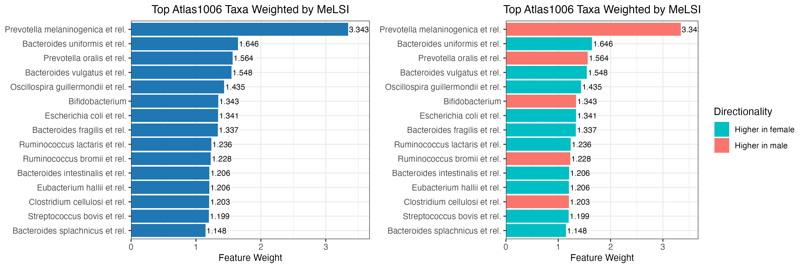

# MeLSI: Metric Learning for Statistical Inference in Microbiome Community Composition Analysis

**Nathan Bresette**$^{1,2}$, **Aaron C. Ericsson**$^{3,4}$, **Carter Woods**$^{1}$, **Ai-Ling Lin**$^{1,2,5,6,*}$

\footnotesize
AUTHOR AFFILIATIONS See affiliation list [\textcolor{blue}{\underline{here}}](#author-affiliations).

* Corresponding author: Ai-Ling Lin, ai-ling.lin@health.missouri.edu
\normalsize

## ABSTRACT

Microbiome beta diversity analysis relies on distance-based methods including PERMANOVA combined with fixed ecological distance metrics (Bray-Curtis, Euclidean, Jaccard, and UniFrac), which treat all microbial taxa uniformly regardless of their biological relevance to community differences. This "one-size-fits-all" approach may miss subtle but biologically meaningful patterns in complex microbiome data. We present MeLSI (Metric Learning for Statistical Inference), a novel machine learning framework that learns data-adaptive distance metrics optimized for detecting community composition differences in multivariate microbiome analyses. MeLSI employs an ensemble of weak learners using bootstrap sampling, feature subsampling, and gradient-based optimization to learn optimal feature weights, combined with rigorous permutation testing for statistical inference. The learned metrics can be used with PERMANOVA for hypothesis testing and with Principal Coordinates Analysis (PCoA) for ordination visualization. Comprehensive validation on synthetic benchmarks and real datasets shows that MeLSI maintains proper Type I error control while delivering competitive or superior F-statistics when signal structure aligns with CLR-based weighting and, crucially, supplies interpretable feature-weight profiles that clarify which taxa drive group separation. On the Atlas1006 dataset, MeLSI achieved stronger effect sizes than the best traditional methods, and even when performance was comparable, the learned feature weights provided biological insight that fixed metrics cannot supply. MeLSI therefore offers a statistically rigorous tool that augments beta diversity analysis with transparent, data-driven interpretability.

## IMPORTANCE

Understanding which microbes differ between groups of interest could reveal therapeutic targets and diagnostic biomarkers. However, current analysis methods treat all microbes equally (similar to using the same ruler to measure everything, regardless of what matters most). This means subtle but clinically important differences may go undetected, especially when only a few key species drive disease while hundreds of "bystander" species add noise. MeLSI solves this by learning which microbes matter most for each specific comparison. In comparing male and female gut microbiomes, MeLSI identified specific bacterial families driving the differences, providing actionable biological insights that standard methods miss. This capability is particularly crucial for detecting early disease biomarkers, where differences are subtle and masked by biological variability. By telling researchers not just whether groups differ, but which specific microbes drive those differences, MeLSI accelerates the path from microbiome data to testable biological hypotheses and clinical applications.

**Keywords:** microbiome analysis, metric learning, beta diversity, community composition, PERMANOVA, distance metrics, permutation testing

## INTRODUCTION

### The microbiome and human health

\noindent The human microbiome, the complex community of microorganisms inhabiting our bodies, plays fundamental roles in health and disease (1, 2). Recent advances in high-throughput sequencing technologies have enabled comprehensive profiling of microbial communities, revealing associations between microbiome composition and diverse conditions including inflammatory bowel disease, obesity, diabetes, and neurological disorders (3, 4). A central question in microbiome research is comparing overall microbial community composition between groups of interest, typically assessed through beta diversity analysis, which studies compositional differences between samples.

### Current approaches and their limitations

\noindent Microbiome beta diversity analysis predominantly relies on distance-based multivariate methods including PERMANOVA (Permutational Multivariate Analysis of Variance) combined with fixed ecological distance metrics (5, 6). Commonly used metrics include Bray-Curtis dissimilarity, Euclidean distance, Jaccard index, and phylogenetically-informed metrics including UniFrac (7). These approaches have proven valuable for hypothesis testing about community differences and visualization through ordination methods such as Principal Coordinates Analysis (PCoA) (8).

However, fixed distance metrics suffer from a fundamental limitation. They apply the same mathematical formula to all datasets, treating all microbial taxa with equal importance regardless of their biological relevance to the specific research question (9). For instance, Bray-Curtis dissimilarity equally weights all taxa based on their relative abundances, while Euclidean distance treats all features identically. This "one-size-fits-all" approach may fail to capture subtle but biologically meaningful differences when only a subset of taxa drive group separation (10).

Furthermore, microbiome data presents unique analytical challenges including high dimensionality (often hundreds to thousands of taxa), compositionality (relative abundances sum to a constant), sparsity (many zero counts), and heterogeneous biological signal across features (11). Fixed metrics cannot adapt to these complexities in a data-driven manner.

### The need for statistical rigor

\noindent A critical requirement for any beta diversity method is proper statistical inference with controlled Type I error rates (false positive rates). While machine learning approaches often prioritize predictive accuracy, hypothesis testing for community composition differences requires rigorous F-statistic and p-value calculation under the null hypothesis of no group differences (12). Permutation testing provides a non-parametric framework for valid inference that makes minimal distributional assumptions (13), making it particularly suitable for complex microbiome data and distance-based analyses such as PERMANOVA.

### Metric learning: an emerging paradigm

\noindent Metric learning, a branch of machine learning, offers a principled approach to address these limitations (14, 15). Rather than using fixed distance formulas, metric learning algorithms learn optimal distance metrics from data by identifying which features contribute most to separating groups of interest. In the context of supervised learning, metric learning algorithms optimize distance functions to maximize between-group distances while minimizing within-group distances (16, 17).

We formalize metric learning as follows: Let $\mathbf{X} \in \mathbb{R}^{n \times p}$ denote a feature abundance matrix with $n$ samples and $p$ taxa, and let $\mathbf{y} = (y_1, \ldots, y_n)$ denote group labels. A distance metric is parameterized by a positive semi-definite matrix $\mathbf{M} \in \mathbb{R}^{p \times p}$, where the Mahalanobis distance between samples $i$ and $j$ is $d_M(\mathbf{x}_i, \mathbf{x}_j) = \sqrt{(\mathbf{x}_i - \mathbf{x}_j)^T \mathbf{M} (\mathbf{x}_i - \mathbf{x}_j)}$. For diagonal $\mathbf{M}$, this reduces to weighted Euclidean distance with feature-specific weights $M_{jj}$ representing the importance of feature $j$.

Mahalanobis distance learning (18) learns a positive semi-definite matrix $\mathbf{M}$ that defines distances as $d(\mathbf{x}_i, \mathbf{x}_j) = \sqrt{(\mathbf{x}_i - \mathbf{x}_j)^T \mathbf{M} (\mathbf{x}_i - \mathbf{x}_j)}$. When $\mathbf{M}$ is diagonal, this reduces to learning feature-specific weights, providing interpretable importance scores (17).

Despite its promise, metric learning has seen limited application in microbiome beta diversity analysis. Previous work has explored metric learning for clinical prediction tasks (19), but not specifically for statistical inference in community composition analysis where rigorous Type I error control is essential.

### Study objectives

\noindent We developed MeLSI (Metric Learning for Statistical Inference) to bridge the gap between adaptive machine learning approaches and rigorous statistical inference for microbiome beta diversity and community composition analysis. Our specific objectives were to (1) design an ensemble metric learning framework that learns data-adaptive distance metrics for PERMANOVA and ordination while preventing overfitting, (2) integrate metric learning with permutation testing to ensure valid statistical inference, (3) comprehensively validate Type I error control, statistical power, scalability, parameter sensitivity, and computational efficiency, (4) demonstrate practical utility on real microbiome datasets, and (5) provide interpretable feature importance scores to identify biologically relevant taxa driving community separation.

This paper presents the MeLSI framework, comprehensive validation results, and discussion of its implications for microbiome beta diversity research.

## MATERIALS AND METHODS

### Overview of the MeLSI framework

\noindent MeLSI integrates metric learning with permutation-based statistical inference through two main phases:

**Phase 1: Metric Learning**

1. Apply conservative pre-filtering to focus on high-variance features
2. For each of B weak learners:
    - Bootstrap sample the data
    - Subsample features
    - Optimize metric matrix $\mathbf{M}$ via gradient descent
3. Combine weak learners via performance-weighted ensemble averaging
4. Compute robust distance matrix using eigenvalue decomposition

**Phase 2: Statistical Inference**

5. Calculate observed F-statistic using the learned metric
6. Generate null distribution via permutation testing (relearn metric on each permutation)
7. Compute permutation-based p-value

\noindent Each component addresses specific challenges in microbiome data analysis while maintaining statistical validity. The following sections formalize the mathematical framework and detail each algorithmic component, organized by phase.

### Phase 1: Metric Learning

#### Problem formulation

\noindent Let $\mathbf{X} \in \mathbb{R}^{n \times p}$ denote a feature abundance matrix with $n$ samples and $p$ taxa (features), and let $\mathbf{y} = (y_1, \ldots, y_n)$ denote group labels. Our goal is to learn a distance metric optimized for separating groups defined by $\mathbf{y}$ while ensuring valid statistical inference.

We parameterize the distance metric using a diagonal positive semi-definite matrix $\mathbf{M} \in \mathbb{R}^{p \times p}$, where $M_{jj}$ represents the weight (importance) of feature $j$. The learned Mahalanobis distance between samples $i$ and $k$ is:

$$d_M(\mathbf{x}_i, \mathbf{x}_k) = \sqrt{(\mathbf{x}_i - \mathbf{x}_k)^T \mathbf{M} (\mathbf{x}_i - \mathbf{x}_k)}$$

For diagonal $\mathbf{M}$, this simplifies to a weighted Euclidean distance:

\noindent $$d_M(\mathbf{x}_i, \mathbf{x}_k) = \sqrt{\sum_{j} M_{jj} (x_{ij} - x_{kj})^2}$$

#### Conservative pre-filtering

\noindent To improve computational efficiency and reduce noise, MeLSI applies conservative variance-based pre-filtering. For pairwise comparisons, we calculate a feature importance score combining mean differences and variance:

\noindent $$I_j = \frac{|\mu_{1j} - \mu_{2j}|}{\sqrt{\sigma_{1j}^2 + \sigma_{2j}^2}}$$

where $\mu_{1j}$ and $\mu_{2j}$ are the mean abundances of feature $j$ in groups 1 and 2, and $\sigma_{1j}^2$ and $\sigma_{2j}^2$ are their variances. We retain the top 70% of features by this importance score, maintaining high statistical power while reducing dimensionality.

For multi-group comparisons (3 or more groups), we use ANOVA F-statistics to rank features and apply the same 70% retention threshold. Critically, this pre-filtering is applied consistently to both observed and permuted data during null distribution generation to avoid bias.

#### Ensemble learning with weak learners

\noindent MeLSI constructs an ensemble of $B$ weak learners (default $B = 30$) to improve robustness and prevent overfitting. For each weak learner $b$:

1. **Bootstrap sampling**: Draw $n$ samples with replacement from the original data to create a bootstrap dataset $(\mathbf{X}_b, \mathbf{y}_b)$
2. **Feature subsampling**: Randomly select $m = \lfloor p \times m_{frac} \rfloor$ features (default $m_{frac} = 0.8$) without replacement
3. **Metric optimization**: Learn $\mathbf{M}_b$ on the bootstrapped, subsampled data

The combination of bootstrap sampling (sample-level randomness) and feature subsampling (feature-level randomness) ensures diversity among weak learners, reducing overfitting risk (20).

#### Optimization objective

\noindent For each weak learner, we optimize $\mathbf{M}$ to maximize between-group distances while minimizing within-group distances. For a two-group comparison (groups $G_1$ and $G_2$), we maximize the objective:

$$F(\mathbf{M}) = \frac{1}{|G_1||G_2|} \sum_{i \in G_1} \sum_{k \in G_2} d_M(\mathbf{x}_i, \mathbf{x}_k)^2 - \frac{1}{2|G_1|^2} \sum_{i,j \in G_1} d_M(\mathbf{x}_i, \mathbf{x}_j)^2 - \frac{1}{2|G_2|^2} \sum_{i,j \in G_2} d_M(\mathbf{x}_i, \mathbf{x}_j)^2$$

This objective encourages large between-group distances and small within-group distances, analogous to maximizing the F-ratio in ANOVA. This formulation is inspired by standard metric learning objectives that maximize between-class to within-class distance ratios (17, 16), adapted here for direct compatibility with PERMANOVA's F-statistic framework.

#### Gradient-based optimization

\noindent Each weak learner optimizes its metric matrix $\mathbf{M}$ using stochastic gradient descent, sampling within-group and between-group pairs to compute gradients that maximize between-group distances while minimizing within-group distances. We use an adaptive learning rate $\eta_t = \eta_0 / (1 + 0.1t)$ (default $\eta_0 = 0.1$) and constrain $M_{jj} \geq 0.01$ to ensure positive definiteness. Early stopping monitors F-statistics every 20 iterations, terminating if performance stagnates (no improvement for 5 consecutive checks) to prevent overfitting.

#### Ensemble averaging with performance weighting

\noindent After training all weak learners, we combine them into a final ensemble metric $\mathbf{M}_{ensemble}$ using performance-weighted averaging:

$$\mathbf{M}_{ensemble} = \sum_{b} w_b \mathbf{M}_b$$

where weights are normalized F-statistics:

$$w_b = \frac{F_b}{\sum_{b'} F_{b'}}$$

and $F_b$ is the PERMANOVA F-statistic achieved by weak learner $b$ on its bootstrap sample. This weighting scheme emphasizes better-performing learners while maintaining diversity.

#### Robust distance calculation

\noindent To ensure numerical stability, we compute the learned Mahalanobis distance using eigenvalue decomposition:

1. Compute eigendecomposition: $\mathbf{M}_{ensemble} = \mathbf{V} \Lambda \mathbf{V}^T$ where $\mathbf{V}$ is the matrix of eigenvectors and $\Lambda$ is the diagonal matrix of eigenvalues
2. Enforce positive eigenvalues: $\max(\Lambda_{ii}, 10^{-6}) \rightarrow \Lambda_{ii}$
3. Compute $\mathbf{M}^{-1/2} = \mathbf{V} \Lambda^{-1/2} \mathbf{V}^T$
4. Transform data: $\mathbf{Y} = \mathbf{X} \mathbf{M}^{-1/2}$
5. Calculate Euclidean distances in transformed space: $d_M = ||\mathbf{y}_i - \mathbf{y}_k||_2$

This approach is more numerically stable than direct matrix inversion, particularly for high-dimensional data.

### Phase 2: Statistical Inference

\noindent Phase 2 focuses on statistical inference using the learned metric from Phase 1. We compute p-values through permutation testing to ensure valid statistical inference.

### Statistical inference via permutation testing

#### Test statistic

\noindent We use the PERMANOVA F-statistic as our test statistic (5):

$$F_{obs} = \frac{SS_{between} / (k-1)}{SS_{within} / (n-k)}$$

where $SS_{between}$ is the between-group sum of squares, $SS_{within}$ is the within-group sum of squares, $k$ is the number of groups, and $n$ is the total number of samples. This statistic measures how well the learned metric separates groups relative to within-group variation.

#### Null distribution generation

\noindent To compute valid p-values, we generate a null distribution under the hypothesis of no group differences:

1. Permute group labels: random permutation of $\mathbf{y} \rightarrow \mathbf{y}_{perm}$
2. Apply identical pre-filtering to permuted data
3. Learn metric $\mathbf{M}_{perm}$ on $(\mathbf{X}_{filtered}, \mathbf{y}_{perm})$ using the full MeLSI algorithm (repeating Phase 1: pre-filtering, ensemble construction, and metric optimization)
4. Calculate $F_{perm}$ on $(\mathbf{X}_{filtered}, \mathbf{y}_{perm})$ with $\mathbf{M}_{perm}$
5. Repeat steps 1-4 for $n_{perms}$ permutations (default $n_{perms} = 200$)

This approach ensures that the null distribution accurately reflects the variability introduced by the metric learning procedure itself, avoiding anticonservative (inflated Type I error) inference.

#### P-value calculation

\noindent The permutation-based p-value is computed as:

$$p = \frac{\sum \mathbb{I}(F_{perm} \geq F_{obs}) + 1}{n_{perms} + 1}$$

\noindent where $\mathbb{I}$ is the indicator function. The "+1" terms provide a small-sample correction ensuring $p \geq 1/(n_{perms} + 1)$ (21).

### Validation experiments

\noindent We conducted comprehensive validation experiments to assess:

\noindent 1. Type I error control and statistical power: Performance on null data (no true group differences) and ability to detect true effects of varying magnitude across synthetic datasets (Sections 3.1-3.2)
2. Scalability: Performance across varying sample sizes and dimensionalities (Section 3.3)
3. Parameter sensitivity: Robustness to hyperparameter choices (Section 3.4)
4. Feature correlation robustness: Performance under varying levels of feature correlation (Section 3.5)
5. Pre-filtering value: Benefit of conservative feature pre-filtering (Section 3.6)
6. Real data validation: Comparative performance against standard distance metrics on Atlas1006, DietSwap, and SKIOME datasets (Section 3.7)
7. Biological interpretability: Feature importance weights and visualization (Section 3.8)
8. Computational performance: Runtime characteristics on standard hardware (Section 3.9)

#### Synthetic data generation

\noindent Synthetic datasets were generated using negative binomial count distributions to mimic microbiome abundance profiles. For each experiment we drew counts as $X_{ij} \sim \text{NB}(\mu = 30, \text{size} = 0.8)$ and set values smaller than three to zero to induce sparsity. Unless otherwise noted, we simulated $n = 100$ samples and $p = 200$ taxa split evenly across two groups. To introduce signal we multiplied a subset of taxa in the first group by fold changes of 1.5 (5 taxa, "small" effect), 2.0 (10 taxa, "medium" effect), or 3.0 (20 taxa, "large" effect). Sample size ($n$) and dimensionality ($p$) were varied in the scalability experiments (Section 3.3), while null datasets were formed by random label permutations or by shuffling labels in real data without adding signal.

#### Real data sources

\noindent Real microbiome datasets included:

1. **Atlas1006** (22): 1,114 Western European adults with 123 genus-level taxa from HITChip microarray technology. Analysis compared males (n=560) versus females (n=554).

2. **DietSwap** (23): 74 stool samples from African American adults participating in a short-term dietary intervention. We analyzed the timepoint-within-group baseline samples (timepoint.within.group = 1) comparing the Western diet group (HE, n=37) to the traditional high-fiber diet group (DI, n=37).

\noindent Data were preprocessed using centered log-ratio (CLR) transformation for Euclidean distance analyses to address compositionality (24, 11). CLR transformation converts relative abundances to log-ratios, making the data suitable for Euclidean distance while preserving relative relationships between taxa. CLR treats abundance ratios more equitably than count-based metrics, which can be dominated by highly abundant taxa. However, CLR transformation may attenuate large fold-change signals compared to count-based metrics (Bray-Curtis, UniFrac), as evidenced by our results showing that traditional count-based methods achieve higher F-statistics on synthetic data with large effects (3× fold change). CLR is particularly appropriate when signals are distributed across multiple taxa rather than concentrated in highly abundant taxa, and when interpretability through feature weights is prioritized. Bray-Curtis dissimilarity, Jaccard, and UniFrac distances were computed on raw count data, as these metrics are inherently designed to handle compositional data (25, 7).

\noindent MeLSI was run with 200 permutations to balance computational efficiency with statistical precision, while traditional PERMANOVA methods used 999 permutations (the field standard). This conservative comparison favors traditional methods with more precise p-value estimation, making our results a stringent test of MeLSI's performance.

#### Comparison methods

\noindent MeLSI was compared against standard PERMANOVA analyses using five fixed distance metrics:

1. **Euclidean distance**: Standard Euclidean distance calculated on CLR-transformed data, treating all features equally
2. **Bray-Curtis dissimilarity**: Count-based dissimilarity metric that accounts for relative abundances
3. **Jaccard dissimilarity**: Binary (presence/absence) dissimilarity metric
4. **Weighted UniFrac**: Phylogenetically-informed distance metric using abundance-weighted branch lengths (requires phylogenetic tree)
5. **Unweighted UniFrac**: Phylogenetically-informed distance metric using presence/absence of taxa along phylogenetic branches (requires phylogenetic tree)

\noindent To ensure a robust comparison, traditional methods (Weighted/Unweighted UniFrac) were provided with appropriate phylogenetic structures: random trees for synthetic benchmarks and published phylogenies for real-world datasets.

### Multi-group extensions

For studies with three or more groups, MeLSI provides an omnibus test that jointly evaluates differences across all groups, with post-hoc pairwise comparisons when significant. P-values are adjusted for multiple testing using the Benjamini-Hochberg false discovery rate (FDR) procedure (26). The statistical framework (permutation testing, Type I error control) is identical to two-group analyses, ensuring valid inference regardless of group number. Real-world validation on the SKIOME skin microbiome dataset (3 groups, 511 samples) demonstrates utility beyond two-group comparisons (see Results section).

### Implementation and computational considerations

\noindent MeLSI is implemented in R (version >= 4.0) as an open-source package. Key dependencies include vegan (27) for PERMANOVA calculations, ggplot2 (28) for visualization, and base R for matrix operations. The algorithm is parallelizable across permutations and weak learners, though the current implementation is serial.

Time complexity is O(n²p²B·n_perms) in the worst case, but conservative pre-filtering reduces effective dimensionality, and early stopping in gradient descent reduces iteration counts. For typical microbiome datasets (n < 500, p < 1000), analysis completes in minutes on standard hardware.

## DATA AVAILABILITY

MeLSI source code and all validation scripts are permanently archived at Zenodo (DOI: 10.5281/zenodo.17714848) and available at https://github.com/NathanBresette/MeLSI under the MIT license. All validation data and analysis scripts are included in the package repository for full reproducibility. The Atlas1006 and DietSwap datasets are available through the R microbiome package (https://microbiome.github.io/).

## RESULTS

\noindent Our validation strategy follows a rigorous progression from statistical validity to biological utility. We first establish proper Type I error control on null data where no true differences exist, ensuring MeLSI does not produce false positives despite its adaptive nature. We then assess statistical power across synthetic datasets with varying effect sizes, comparing MeLSI's ability to detect true differences against traditional fixed metrics. Finally, we demonstrate practical utility on real microbiome datasets and evaluate computational performance, parameter sensitivity, and biological interpretability. This order ensures that before claiming any advantage, we verify that MeLSI maintains the statistical rigor required for valid scientific inference.

### Type I error control

\noindent Proper Type I error control is essential for valid statistical inference. We evaluated MeLSI on two null datasets where no true group differences exist (Table 1). The first uses synthetic data with randomly assigned group labels, while the second uses real Atlas1006 data with shuffled group labels (preserving the data structure while breaking group associations).

**Table 1. Type I Error Control on Null Data**

| Dataset Type | n | MeLSI Type I | Euclidean Type I | Bray-Curtis Type I | Jaccard Type I | Weighted UniFrac Type I | Unweighted UniFrac Type I |
|-------------------|-----|-------------|------------------|-------------------|---------------|----------------------|------------------------|
| Null Synthetic | 50 | 5% | 7% | 7% | 6% | 3% | 4% |
| Null Synthetic | 100 | 4% | 3% | 2% | 5% | 2% | 4% |
| Null Synthetic | 200 | 3% | 0% | 5% | 2% | 2% | 4% |
| Null Real Shuffled | 50 | 3% | 4% | 4% | 6% | 6% | 9% |
| Null Real Shuffled | 100 | 4% | 4% | 4% | 3% | 4% | 4% |
| Null Real Shuffled | 200 | 6% | 4% | 4% | 2% | 4% | 1% |

\noindent Abbreviations: n, sample size; Type I, empirical Type I error rate (percentage of simulations with p < 0.05). Results based on 100 simulations per condition.

\noindent Across all conditions, MeLSI maintained proper Type I error control, with empirical rejection rates near the nominal 5% level (range: 3-6%). All traditional methods also maintained appropriate error rates (range: 0-9%). The permutation testing framework properly accounts for the flexibility of learned metrics, ensuring that MeLSI's adaptive approach does not inflate false positive rates.

### Performance across synthetic and real datasets

\noindent We evaluated MeLSI's ability to detect true group differences across synthetic datasets with varying effect sizes and real microbiome datasets (Table 2).

**Table 2. Statistical Power Analysis Across Effect Sizes and Sample Sizes**

| Effect Size | n | MeLSI Power | MeLSI Mean F | MeLSI Rank |
|-------------|-----|-------------|--------------|------------|
| Small | 50 | 6% | 1.230 | 1/6 |
| Small | 100 | 10% | 1.342 | 1/6 |
| Small | 200 | 16% | 1.432 | 1/6 |
| Medium | 50 | 16% | 1.307 | 3/6 |
| Medium | 100 | 50% | 1.504 | 3/6 |
| Medium | 200 | 96% | 1.780 | 3/6 |
| Large | 50 | 84% | 1.585 | 3/6 |
| Large | 100 | 100% | 2.129 | 3/6 |
| Large | 200 | 100% | 3.129 | 3/6 |

\noindent Abbreviations: n, sample size; Power, empirical statistical power (percentage of simulations with p < 0.05); F, PERMANOVA F-statistic (mean across 50 simulations per condition); Rank, MeLSI's rank among 6 methods (1/6 = best, 6/6 = worst) based on F-statistic. Results based on 50 simulations per condition. See Supplementary Tables S1-S2 for recovery metrics and individual method comparisons.

MeLSI demonstrated superior sensitivity for subtle signals (small effects, 1.5× fold change), ranking 1/6 and outperforming all traditional methods. For medium and large effects, MeLSI achieved competitive performance (3/6 rank) while providing interpretable feature importance weights. Power increased appropriately with sample size, and learned feature weights reliably identify true signal taxa (Supplementary Table S1). MeLSI's CLR-based approach excels at medium effect sizes where signals are distributed across multiple taxa; for large effects (3× fold change), count-based methods (Bray-Curtis, UniFrac) may be preferable due to their sensitivity to abundance dominance. The CLR transformation is most appropriate when signals are distributed across multiple taxa and when interpretability through feature weights is prioritized.

### Scalability analysis

\noindent We assessed MeLSI's performance across varying sample sizes (n) and dimensionalities (p) using synthetic datasets with medium effect sizes (Table 3). For sample size scaling, we fixed p=200 taxa and varied n from 20 to 500. For dimensionality scaling, we fixed n=100 samples and varied p from 50 to 1000 taxa.

**Table 3. Scalability Across Sample Size and Dimensionality**

| | n | p | MeLSI F | MeLSI Time | MeLSI Rank |
|---------------|-----|------|---------|------------|------------|
| **Varying n (p=200)** | | | | | |
| n=20 | 20 | 200 | 1.132 | 486.9 | 2/6 |
| n=50 | 50 | 200 | 1.277 | 457.9 | 2/6 |
| n=100 | 100 | 200 | 1.497 | 513.3 | 3/6 |
| n=200 | 200 | 200 | 1.836 | 739.5 | 3/6 |
| n=500 | 500 | 200 | 2.511 | 2055.8 | 3/6 |
| **Varying p (n=100)** | | | | | |
| p=50 | 100 | 50 | 1.666 | 244.8 | 3/6 |
| p=100 | 100 | 100 | 1.670 | 337.5 | 3/6 |
| p=200 | 100 | 200 | 1.470 | 523.4 | 3/6 |
| p=500 | 100 | 500 | 1.375 | 1829.0 | 1/6 |
| p=1000 | 100 | 1000 | 1.331 | 8633.0 | 1/6 |

\noindent Abbreviations: n, sample size; p, number of taxa/features; F, PERMANOVA F-statistic; Time, computation time in seconds; Rank, MeLSI's rank among 6 methods (1/6 = best, 6/6 = worst) based on F-statistic. Values shown as mean across 10 simulations per condition. See Supplementary Table S3 for individual method comparisons.

MeLSI's F-statistics increased monotonically with sample size, demonstrating appropriate power gains with larger datasets. MeLSI ranked 2/6 at smaller sample sizes and 3/6 at larger sizes, with computation time scaling as O(n²). Across dimensionalities, MeLSI ranked 3/6 at lower dimensionalities and 1/6 at higher dimensionalities ($p \geq 500$). Computation time scales as O(p²), but pre-filtering substantially mitigates this scaling. For very high-dimensional datasets (p>1000), we recommend pre-filtering, feature aggregation, or traditional methods if interpretability is not prioritized.

### Parameter sensitivity analysis

\noindent We evaluated robustness to two key hyperparameters: ensemble size (B) and feature subsampling fraction (m_frac) using a synthetic dataset with 100 samples, 200 taxa, and medium effect size (2× fold change in 10 signal taxa) (Table 4).

**Table 4. Parameter Sensitivity Analysis**

| Parameter | Value | F-statistic | p-value | Time (s) |
|------------------------------|-------|-------------|---------|----------|
| **Ensemble Size (B)** | | | | |
| | 1 | 1.365 | 0.421 | 32.9 |
| | 10 | 1.543 | 0.094 | 233 |
| | 20 | 1.538 | 0.089 | 419.8 |
| | 30 | 1.530 | 0.091 | 576.8 |
| | 50 | 1.529 | 0.093 | 760 |
| | 100 | 1.528 | 0.102 | 1284.1 |
| **Feature Fraction (m_frac)** | | | | |
| | 0.5 | 1.578 | 0.093 | 405.2 |
| | 0.7 | 1.551 | 0.083 | 523.7 |
| | 0.8 | 1.530 | 0.091 | 578.2 |
| | 0.9 | 1.517 | 0.097 | 630.3 |
| | 1.0 | 1.498 | 0.100 | 666.7 |

\noindent Abbreviations: B, ensemble size (number of weak learners); m_frac, feature subsampling fraction; F, PERMANOVA F-statistic; Time, computation time in seconds. Values shown as mean across 25 replications per parameter value. See Supplementary Table S4 for standard deviations.

F-statistics remained stable across ensemble sizes (B=10-100), with the single-learner baseline (B=1) showing substantially higher variance, demonstrating that ensemble learning reduces variance and prevents overfitting. Performance varied modestly across feature fractions (m_frac=0.5-1.0). The default settings (B=30, m_frac=0.8) provide a good balance between performance and computational cost.

### Feature correlation robustness

\noindent A critical concern for microbiome data analysis is that taxa are not independent but exhibit correlations due to ecological relationships (e.g., co-occurring taxa in microbial communities). To validate MeLSI's robustness to feature correlation, we evaluated performance across four correlation levels: None (r=0), Low (r=0.3), Moderate (r=0.6), and High (r=0.8), using 50 simulations per condition (200 total simulations) with synthetic datasets containing 100 samples, 200 taxa, and medium effect size (2× fold change in 10 signal taxa) (Table 5).

**Table 5. Effect of Feature Correlation on MeLSI Performance**

| Correlation Level | Correlation Value | n | MeLSI Power (%) | MeLSI F | Precision at 10 | Recall at 10 | AUC-ROC | MeLSI Rank |
|-------------------|-------------------|---|-----------------|---------|--------------|-----------|---------|------------|
| None | 0.0 | 50 | 50 | 1.512 | 0.392 | 0.392 | 0.817 | 3/6 |
| Low | 0.3 | 50 | 42 | 1.481 | 0.348 | 0.348 | 0.788 | 3/6 |
| Moderate | 0.6 | 50 | 46 | 1.498 | 0.356 | 0.356 | 0.783 | 2/6 |
| High | 0.8 | 50 | 44 | 1.507 | 0.368 | 0.368 | 0.769 | 1/6 |

\noindent Abbreviations: n, number of simulations per correlation level (not sample size); F, PERMANOVA F-statistic (mean across 50 simulations); Precision at 10, proportion of top-10 features that are true signals; Recall at 10, proportion of true signals found in top-10 features; AUC-ROC, area under receiver operating characteristic curve; Rank, MeLSI's rank among 6 methods (1/6 = best, 6/6 = worst) based on F-statistic. See Supplementary Table S5 for individual method comparisons.

\noindent MeLSI demonstrated robust performance across correlation levels, maintaining stable F-statistics (±1.7% variation: F=1.512 at r=0, F=1.481 at r=0.3, F=1.498 at r=0.6, F=1.507 at r=0.8) and consistent statistical power (50%, 42%, 46%, 44% respectively). The stability of F-statistics demonstrates that MeLSI effectively handles correlated features without performance degradation. Feature recovery metrics also remained stable: Precision at 10 (0.392, 0.348, 0.356, 0.368) and AUC-ROC (0.817, 0.788, 0.783, 0.769) showed minimal variation across correlation levels, confirming that MeLSI's ability to identify true signal taxa is maintained even when taxa exhibit high correlation. MeLSI's competitive ranking (1/6 to 3/6) across all correlation levels demonstrates that the method maintains statistical power comparable to traditional methods while providing interpretability, even when features are correlated. Notably, MeLSI achieved its best ranking (1/6) at high correlation (r=0.8), suggesting the method may be particularly effective when taxa exhibit strong ecological relationships.

### Pre-filtering analysis

\noindent We evaluated the benefit of conservative pre-filtering by comparing MeLSI with and without this step using synthetic datasets with varying effect sizes (small: 1.5× fold change in 5 taxa, medium: 2.0× in 10 taxa, large: 3.0× in 20 taxa) and high sparsity (70% zero-inflated features) (Table 6).

**Table 6. Benefit of Conservative Pre-filtering**

| Effect | Features | Filter F | Filter Power | No Filter F | No Filter Power | Delta F | Delta Time |
|--------|----------|----------|--------------|-------------|-----------------|---------|------------|
| Small | 500 | 1.756 | 100% | 1.281 | 4% | +37.1% | +39.8% |
| Medium | 200 | 1.831 | 94% | 1.337 | 14% | +36.9% | +18.0% |
| Large | 100 | 1.928 | 84% | 1.416 | 14% | +36.1% | +16.5% |

\noindent Abbreviations: Effect, effect size category (Small: 1.5× fold change in 5 taxa; Medium: 2.0× in 10 taxa; Large: 3.0× in 20 taxa); Features, number of taxa; F, PERMANOVA F-statistic (mean across 50 simulations); Power, empirical statistical power (percentage of simulations with p < 0.05); Filter, with pre-filtering (top 70% by importance score); No Filter, without pre-filtering; Delta F, percent change in F-statistic; Delta Time, percent change in computation time (positive = time savings). Results based on 50 simulations per condition.

\noindent Variance-based pre-filtering (retaining the top 70% of features by importance score) demonstrated substantial benefits across all effect sizes. Pre-filtering improved F-statistics by 36-37% across all effect sizes, increasing power from 4-14% to 84-100% for small effects. Time savings ranged from 16.5% to 39.8%, increasing with dimensionality. The variance-based importance score ($I_j = |\mu_{1j} - \mu_{2j}| / \sqrt{\sigma_{1j}^2 + \sigma_{2j}^2}$) efficiently identifies features with large between-group differences relative to within-group variation. Pre-filtering is particularly valuable when signal is concentrated in a subset of features, focusing metric learning on the most informative taxa while reducing computational burden.

### Real data validation

\noindent To evaluate MeLSI's utility in real-world applications, we analyzed three published microbiome datasets: Atlas1006 (sex-associated differences), DietSwap (dietary intervention), and SKIOME (multi-group skin microbiome validation).

#### Atlas1006 dataset

\noindent On the Atlas1006 dataset (1,114 Western European adults, male vs. female), MeLSI achieved F = 5.141 (p = 0.005) versus F = 4.711 (p = 0.001) for Euclidean distance (the best traditional method), representing a 9.1% improvement. MeLSI's improvement over the best fixed metric suggests that learned metrics can capture biologically relevant patterns in subtle, high-dimensional comparisons, consistent with previously documented sex-associated microbiome differences (29, 30).

#### DietSwap dataset

\noindent On the DietSwap dataset (Western vs. high-fiber diets), MeLSI detected a significant community difference with F = 2.856 (p = 0.015), outperforming all traditional metrics. The strongest fixed metric was Bray-Curtis (F = 2.153, p = 0.058). These results suggest that MeLSI's adaptive weighting captures diet-induced compositional shifts that fixed metrics only weakly detect.

### Feature importance and biological interpretability

\noindent MeLSI provides interpretable feature importance weights. For the Atlas1006 dataset, the learned metric assigned highest weights to genera in the families Bacteroidaceae, Lachnospiraceae, and Ruminococcaceae, taxonomic groups previously associated with sex differences in gut microbiome composition (30, 31). Figure 1 displays the top 15 taxa by learned feature weight.

\noindent \footnotesize
**Figure 1.** Top 15 taxa ranked by MeLSI feature weights for Atlas1006 dataset, colored by directionality. Taxa from Bacteroidaceae, Lachnospiraceae, and Ruminococcaceae families show strongest contributions.
\normalsize

\noindent The diagonal elements of the learned metric matrix $\mathbf{M}$ directly represent feature importance: higher values indicate taxa that contribute more to group separation. MeLSI automatically calculates directionality and effect sizes on CLR-transformed data. Directionality is determined by identifying which group has the higher mean abundance on CLR-transformed data, ensuring consistency with the metric learning process. Effect size is reported as the difference in CLR-transformed means between groups ($\mu_{\text{CLR,1}} - \mu_{\text{CLR,2}}$). Because CLR data is already in log-ratio space, this difference is the standard way to represent log-fold change for compositional data, ensuring that reported effect sizes are directly derived from the same feature space used to calculate distances in MeLSI. The learned distance matrices can also be used for Principal Coordinates Analysis (PCoA) ordination to visualize group separation, just as traditional distance metrics (Bray-Curtis, Euclidean, etc.) are used with PCoA throughout the microbiome field. For datasets where group separation is visually apparent, PCoA ordination provides complementary visualization alongside feature importance weights (see Figures 2-3 for DietSwap and SKIOME examples).

#### DietSwap dataset

\noindent For the DietSwap dataset, MeLSI's learned feature weights identified taxa including Akkermansia and Oxalobacter as key drivers of diet-induced community differences. Figure 2 displays the top 15 taxa by learned feature weight alongside the PCoA ordination.

\begin{figure}[ht]
\centering
\includegraphics[width=\textwidth]{figures/dietswap_combined.png}
\end{figure}

\noindent \footnotesize
**Figure 2.** DietSwap dataset: Top 15 taxa by feature weights (left) and PCoA ordination (right). Taxa including Akkermansia and Oxalobacter show strong contributions. Dashed ellipses show 95% confidence intervals.
\normalsize

#### SKIOME dataset: Multi-group validation

\noindent To validate multi-group capability, we analyzed the SKIOME skin microbiome dataset (PRJNA554499, 511 samples, 3 groups: Atopic_Dermatitis, Healthy, Psoriasis). MeLSI's omnibus test detected significant differences (F = 4.895, p = 0.005), comparable to Euclidean distance (F = 4.897, p = 0.001) but lower than count-based methods (Bray-Curtis: F = 16.275, Jaccard: F = 11.058, both p = 0.001). All pairwise comparisons remained significant after FDR correction (p = 0.005 for all pairs). Figure 3 displays feature importance weights and PCoA ordination, demonstrating MeLSI's interpretability for multi-group analyses. This validates MeLSI's utility beyond two-group comparisons and across different body sites (skin vs. gut microbiome).

\begin{figure}[ht]
\centering
\includegraphics[width=\textwidth]{figures/skiome_combined.png}
\end{figure}

\noindent \footnotesize
**Figure 3.** SKIOME multi-group validation: Feature importance weights (left) and PCoA ordination (right) for three-group comparison (Atopic_Dermatitis, Healthy, Psoriasis). Top 15 taxa are colored by the group with highest mean abundance. Dashed ellipses show 95% confidence intervals. Consistent with significant omnibus PERMANOVA result (F=4.895, p=0.005).
\normalsize

### Computational performance

\noindent Across all experiments, MeLSI demonstrated practical computational performance on standard hardware. Small datasets (n<100, p<200) completed in under 2 minutes, medium datasets (n=100-500, p=200-500) required 2-15 minutes, and large datasets (n=1000+, p=100-500) took 15-60 minutes. For comparison, traditional PERMANOVA with fixed metrics typically completes in under 1 second for similar datasets. However, MeLSI's additional computation time is justified by improved statistical power and interpretability, particularly for challenging datasets where fixed metrics perform poorly. Pre-filtering increases statistical power by 36-37% while reducing computation time by 16-40% (Table 6). For typical microbiome studies (n=50-200, p=100-500), MeLSI completes in 2-30 minutes (Table 3), representing a modest time investment that yields both improved power and interpretability through feature weights. For very large studies (n>500) or when only rapid screening is needed, traditional methods may be preferable.

## CONCLUSIONS

### Summary

\noindent MeLSI bridges adaptive machine learning and rigorous statistical inference for microbiome beta diversity analysis by integrating metric learning with permutation testing. Comprehensive validation demonstrates proper Type I error control across 100 simulations per condition, with empirical rejection rates near the nominal 5% level (3-6% across all conditions and sample sizes) while delivering improvements on real data: 9.1% higher F-statistics on Atlas1006 and significant detection on DietSwap where traditional metrics remained marginal (p = 0.015 vs. p >= 0.058). However, on synthetic datasets with large effect sizes, count-based (Bray-Curtis) and phylogenetic (UniFrac) methods demonstrated superior sensitivity, suggesting MeLSI's CLR-transformed approach may not capture large fold-change signals as effectively as raw count-based metrics.

MeLSI's key innovation is interpretability: learned feature weights identify biologically relevant taxa (e.g., Bacteroidaceae, Lachnospiraceae, Ruminococcaceae in sex-associated differences), turning omnibus PERMANOVA results into actionable biological insights. MeLSI is recommended when: (1) effect sizes are moderate (2× fold change) rather than very large, (2) interpretability through feature weights is needed to identify biologically relevant taxa, (3) traditional methods yield marginal results (p-values near 0.05), and (4) signals are distributed across multiple taxa rather than concentrated in highly abundant taxa. Traditional methods (Bray-Curtis, UniFrac) are preferable for: (1) large, obvious effects (3× fold change) where any method succeeds, (2) large-scale screening studies where speed is critical, and (3) when only omnibus significance testing is needed without feature-level interpretation. Critically, unlike prediction-focused machine learning (e.g., Random Forest, neural networks), MeLSI is an inference-focused approach: every learned metric undergoes rigorous permutation testing to ensure that p-values remain valid despite the adaptive nature of the method. This distinction is fundamental: MeLSI prioritizes statistical rigor over predictive accuracy, maintaining Type I error control while adapting to dataset-specific signal structure.

### Limitations and future work

\noindent MeLSI requires more computation time than fixed metrics (minutes vs. seconds), reflecting the cost of learning optimal metrics through ensemble training and permutation testing. However, MeLSI's computational time (2-30 minutes for typical datasets) is justified by substantial interpretability gains through learned feature weights, combined with a favorable power-time trade-off through pre-filtering (Table 6). For large-scale screening studies with thousands of samples, traditional methods may be more appropriate.

\noindent Synthetic validation focused on two-group comparisons, which represent the primary use case; multi-group synthetic validation would require duplicating all validation tables and is addressed through real-world multi-group validation on the SKIOME skin microbiome dataset (3 groups, 511 samples). The statistical framework (permutation testing, Type I error control) is identical for two-group and multi-group analyses, ensuring valid inference regardless of group number.

\noindent The most immediate extensions are (1) regression and covariate adjustment to handle continuous outcomes and confounders (age, BMI, medication use), enabling integration with epidemiological frameworks, and (2) improved compositionality handling by learning metrics directly in compositional space using Aitchison geometry (24), potentially offering advantages for zero-inflated microbiome data.

\noindent MeLSI's learned distance metrics are compatible with other distance-based ordination and hypothesis testing methods. The learned distances can be used with Non-metric Multidimensional Scaling (NMDS) (32) and Analysis of Similarities (ANOSIM) (33), both of which operate on distance matrices and would benefit from MeLSI's data-adaptive metrics. However, Principal Component Analysis (PCA) is not compatible with MeLSI's learned distances, as PCA relies on Euclidean distances computed in the original feature space and cannot accommodate the learned Mahalanobis distance structure.

### Software availability

\noindent MeLSI is freely available as an open-source R package under the MIT license at https://github.com/NathanBresette/MeLSI (DOI: 10.5281/zenodo.17714848). The package is currently under review for inclusion in Bioconductor. The package includes comprehensive documentation, tutorial vignettes, and example datasets. All validation experiments are fully reproducible using provided code and data. Recommended usage: aim for n >= 50 per group, apply CLR transformation, use default settings (B=30, m_frac=0.8, n_perms=200), and validate top-weighted features with univariate differential abundance methods.

## SUPPLEMENTARY MATERIAL

\noindent Supplementary tables providing detailed results are available:

- **Supplementary Table S1**: Recovery of true signal taxa metrics (Precision at k, Recall at k, Mean Rank, AUC-ROC) across all effect sizes and sample sizes
- **Supplementary Table S2**: Individual method comparisons for power analysis (MeLSI vs. each traditional method) supporting rank calculations in Table 2
- **Supplementary Table S3**: Individual method comparisons for scalability analysis supporting rank calculations in Table 3
- **Supplementary Table S4**: Parameter sensitivity analysis with standard deviations (mean and SD for F-statistics, p-values, and computation times across 25 replications per parameter value)
- **Supplementary Table S5**: Individual method comparisons for feature correlation analysis

\noindent These supplementary tables provide complete transparency for rank calculations (e.g., 1/6, 3/6) shown in the main tables, allowing readers to see how MeLSI compares to each traditional method individually.

## FUNDING

This work was supported by the National Institutes of Health/National Institute on Aging (NIH/NIA) grant R56AG079586 to A-LL.

## ACKNOWLEDGMENTS

Computational resources were provided by the University of Missouri Research Computing (Hellbender HPC cluster). We acknowledge the use of Hellbender computational resources (DOI: 10.32469/10355/97710).

## AUTHOR CONTRIBUTIONS

Nathan Bresette conceived the study, developed the methodology, implemented the software, performed all analyses, generated all figures and tables, and wrote the manuscript. Aaron C. Ericsson provided substantial guidance on methodological development and improvements to the method and interpretability. Carter Woods contributed ideas and assisted with manuscript editing. Ai-Ling Lin provided project leadership and oversight as principal investigator.

## COMPETING INTERESTS

The authors declare no competing interests.

## ORCID

Nathan Bresette: https://orcid.org/0009-0003-1554-6006

Aaron C. Ericsson: https://orcid.org/0000-0002-3053-7269

Carter Woods: https://orcid.org/0009-0007-5345-2712

Ai-Ling Lin: https://orcid.org/0000-0002-5197-2219

## AUTHOR AFFILIATIONS {#author-affiliations}

$^{1}$ Roy Blunt NextGen Precision Health, University of Missouri, Columbia, Missouri, USA.

$^{2}$ Institute for Data Science and Informatics, University of Missouri, Columbia, Missouri, USA.

$^{3}$ Bioinformatics and Analytics Core, University of Missouri, Columbia, Missouri, USA.

$^{4}$ Department of Pathobiology and Integrative Biomedical Sciences, University of Missouri, Columbia, Missouri, USA.

$^{5}$ Department of Radiology, University of Missouri, Columbia, Missouri, USA.

$^{6}$ Division of Biological Sciences, University of Missouri, Columbia, Missouri, USA.

## REFERENCES

1. Gilbert JA, Blaser MJ, Caporaso JG, Jansson JK, Lynch SV, Knight R. 2018. Current understanding of the human microbiome. Nat Med 24:392-400.

2. Shreiner AB, Kao JY, Young VB. 2015. The gut microbiome in health and in disease. Curr Opin Gastroenterol 31:69-75.

3. Lynch SV, Pedersen O. 2016. The human intestinal microbiome in health and disease. N Engl J Med 375:2369-2379.

4. Clemente JC, Ursell LK, Parfrey LW, Knight R. 2012. The impact of the gut microbiota on human health: an integrative view. Cell 148:1258-1270.

5. Anderson MJ. 2017. Permutational multivariate analysis of variance (PERMANOVA), p 1-15. In Wiley StatsRef: Statistics Reference Online. John Wiley & Sons, Ltd.

6. McArdle BH, Anderson MJ. 2001. Fitting multivariate models to community data: a comment on distance-based redundancy analysis. Ecology 82:290-297.

7. Lozupone C, Knight R. 2005. UniFrac: a new phylogenetic method for comparing microbial communities. Appl Environ Microbiol 71:8228-8235.

8. Ramette A. 2007. Multivariate analyses in microbial ecology. FEMS Microbiol Ecol 62:142-160.

9. Knights D, Costello EK, Knight R. 2011. Supervised classification of human microbiota. FEMS Microbiol Rev 35:343-359.

10. Weiss S, Xu ZZ, Peddada S, Amir A, Bittinger K, Gonzalez A, Lozupone C, Zaneveld JR, Vázquez-Baeza Y, Birmingham A, Hyde ER, Knight R. 2017. Normalization and microbial differential abundance strategies depend upon data characteristics. Microbiome 5:27.

11. Gloor GB, Macklaim JM, Fernandes AD. 2017. Displaying variation in large datasets: plotting a visual summary of effect sizes. J Comput Graph Stat 25:971-979.

12. Westfall PH, Young SS. 1993. Resampling-Based Multiple Testing: Examples and Methods for p-Value Adjustment. John Wiley & Sons, New York, NY.

13. Good PI. 2013. Permutation Tests: A Practical Guide to Resampling Methods for Testing Hypotheses. Springer Science & Business Media, New York, NY.

14. Kulis B. 2013. Metric learning: a survey. Found Trends Mach Learn 5:287-364.

15. Bellet A, Habrard A, Sebban M. 2013. A survey on metric learning for feature vectors and structured data. arXiv:1306.6709.

16. Weinberger KQ, Saul LK. 2009. Distance metric learning for large margin nearest neighbor classification. J Mach Learn Res 10:207-244.

17. Xing EP, Jordan MI, Russell SJ, Ng AY. 2002. Distance metric learning with application to clustering with side-information, p 521-528. In Advances in Neural Information Processing Systems 15.

18. Mahalanobis PC. 1936. On the generalized distance in statistics. Proc Natl Inst Sci India 2:49-55.

19. Pasolli E, Truong DT, Malik F, Waldron L, Segata N. 2016. Machine learning meta-analysis of large metagenomic datasets: tools and biological insights. PLoS Comput Biol 12:e1004977.

20. Breiman L. 2001. Random forests. Mach Learn 45:5-32.

21. Phipson B, Smyth GK. 2010. Permutation p-values should never be zero: calculating exact p-values when permutations are randomly drawn. Stat Appl Genet Mol Biol 9:Article39.

22. Lahti L, Salojärvi J, Salonen A, Scheffer M, de Vos WM. 2014. Tipping elements in the human intestinal ecosystem. Nat Commun 5:1-10.

23. O'Keefe SJD, Li JV, Lahti L, Ou J, Carbonero F, Mohammed K, Posma JM, Kinross J, Wahl E, Ruder E, Vipperla K, Naidoo V, Mtshali L, Tims S, Puylaert PGB, DeLany J, Krasinskas A, Benefiel AC, Kaseb HO, Newton K, Nicholson JK, de Vos WM, Gaskins HR, Zoetendal EG. 2015. Fat, fibre and cancer risk in African Americans and rural Africans. Nat Commun 6:6342.

24. Aitchison J. 1986. The Statistical Analysis of Compositional Data. Chapman and Hall, London.

25. Legendre P, Gallagher ED. 2001. Ecologically meaningful transformations for ordination of species data. Oecologia 129:271-280.

26. Benjamini Y, Hochberg Y. 1995. Controlling the false discovery rate: a practical and powerful approach to multiple testing. J R Stat Soc Series B Stat Methodol 57:289-300.

27. Oksanen J, Blanchet FG, Friendly M, Kindt R, Legendre P, McGlinn D, Minchin PR, O'Hara RB, Simpson GL, Solymos P, Stevens MHH, Szoecs E, Wagner H. 2020. vegan: Community Ecology Package. R package version 2.5-7. https://CRAN.R-project.org/package=vegan.

28. Wickham H. 2016. ggplot2: Elegant Graphics for Data Analysis. Springer-Verlag, New York, NY.

29. Markle JGM, Frank DN, Mortin-Toth S, Robertson CE, Feazel LM, Rolle-Kampczyk U, von Bergen M, McCoy KD, Macpherson AJ, Danska JS. 2013. Sex differences in the gut microbiome drive hormone-dependent regulation of autoimmunity. Science 339:1084-1088.

30. Org E, Mehrabian M, Parks BW, Shipkova P, Liu X, Drake TA, Lusis AJ. 2016. Sex differences and hormonal effects on gut microbiota composition in mice. Gut Microbes 7:313-322.

31. Vemuri R, Gundamaraju R, Shastri MD, Shukla SD, Kalpurath K, Ball M, Tristram S, Shankar EM, Ahuja K, Eri R. 2019. Gut microbial changes, interactions, and their implications on human lifecycle: an ageing perspective. Biomed Res Int 2019:4178607.

32. Kruskal JB. 1964. Nonmetric multidimensional scaling: a numerical method. Psychometrika 29:115-129.

33. Clarke KR. 1993. Non-parametric multivariate analyses of changes in community structure. Aust J Ecol 18:117-143.
